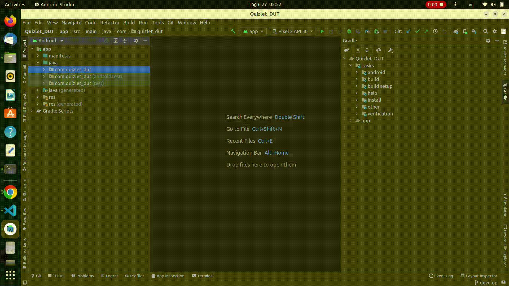
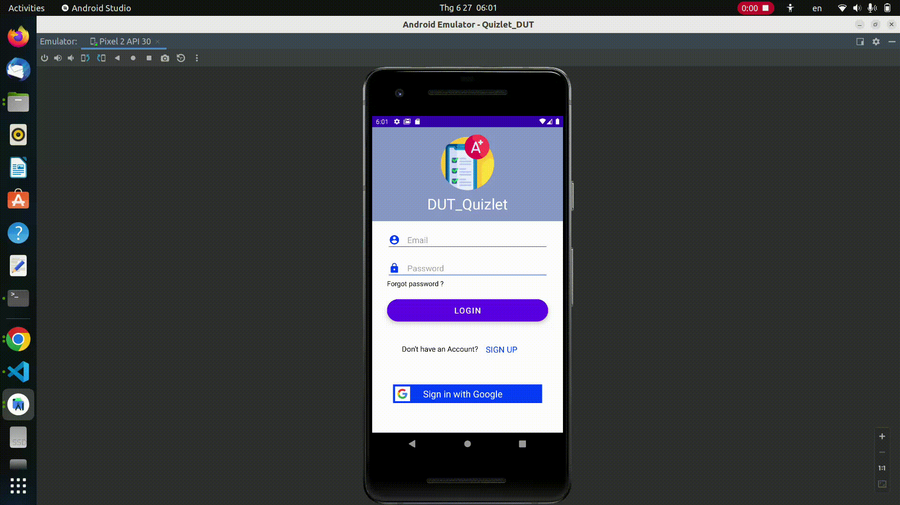
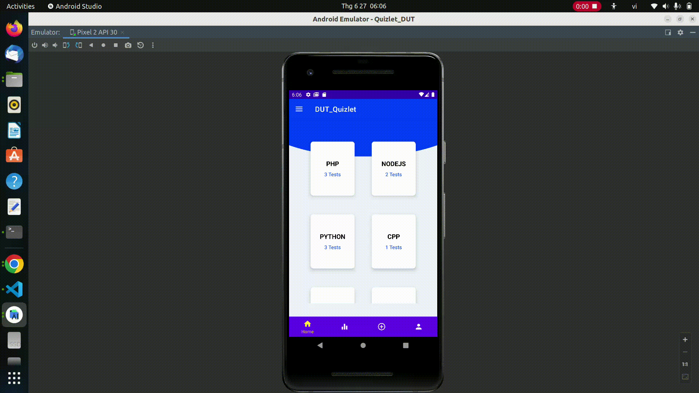
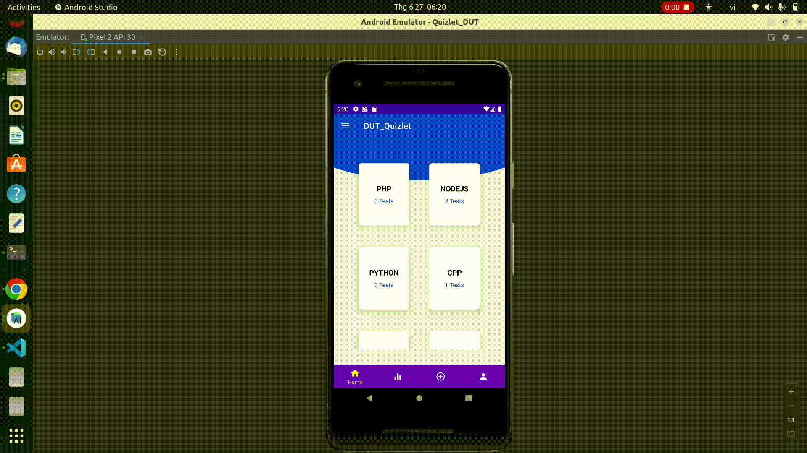

# Dự án cuối khóa
### Đề tài: Ứng dụng kiểm tra thông qua câu hỏi trắc nghiệm quizlet.
### Danh sách thành viên:
|STT|Tên|Chức vụ|Email|
|-|-|-|-|
|1|Trần Thế Vũ|Giảng viên giảng dạy|None|
|2|Đồng Minh Phú| Sinh viên |None|
|3|Trần Phước Thiện|Sinh viên|None|
|4|Trần Trung Quân|Sinh viên|None|
|5|Đỗ Phú Thành|Sinh viên|None|
### Thông tin ứng dụng:
  - Ngôn ngữ sử dụng: Java.
  - IDE: Android studio 2021
  - GUI: XML.
  - Database: FireBase.
### Cách cài đặt:
  - B1: Cài đặt các ứng dụng cần thiết: [Android studio 2021](https://developer.android.com/studio)
  - B2: Tải Source Code về máy. (Có thể tải dạng file .zip rồi giải nén, hoặc git clone về nếu máy đã cài đặt git).

### Khởi chạy ứng dụng:
  
### Một vài chức năng của ứng dụng:
  - Chức năng đăng ký, đăng nhập bằng email:
  

  - Chức năng đăng ký, đăng nhập bằng google:
  

  - Chức năng làm bài test theo chủ đề, chuyên đề:
  

  - Chức năng thêm bài test:
  

  - Chức năng hiển thành thông tin bài test, gắn bookmark cho câu hỏi khi test:
  

  - Chức năng hiển thị bảng xếp hạng, thông tin cá nhân,đăng xuất:
  
  ### Hết!
  - Ứng dụng vẫn còn nhiều thiếu sót, nhưng với mục đích chia sẽ đến cộng đồng, mong rằng nó sẽ giúp ích cho bạn 1 phần nào đó!
  - Cảm ơn bạn đã xem đến cuối bài! Nếu bạn thấy hay thì hãy cho nhóm mình 1 sao nhé!😍😍😍
  - Bản demo toàn bộ chức năng của ứng dụng sẽ sớm có [tại đây]()!
  ---
  
  
